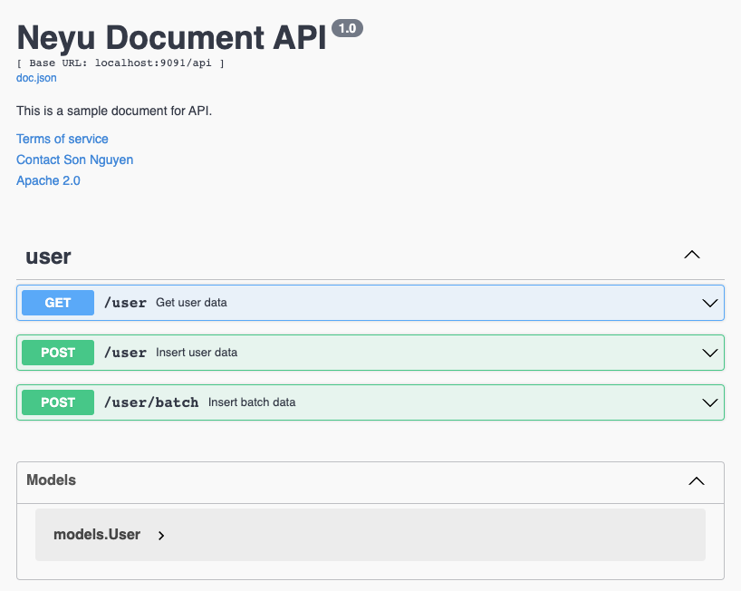

# Golang API skeleton

This is a basic layout for bulding API by [Golang](https://go.dev/)

<a href="https://gitlab.salespikes.global/tms-repo/skeleton/golang-api"></a>
<a href="https://go.dev/"></a>
<a href="https://github.com/gin-gonic/gin"></a>
<a href="https://jmoiron.github.io/sqlx/"></a>
<a href="https://github.com/swaggo/swag"></a>

## Table of contents

- [Features](#features)
- [To do list](#to-do-list)
- [Directory Structure](#directory-structure)
- [Requirements](#requirements)
- [How to work](#how-to-work)
  * [1. Implement an API](#1-implement-an-api)
  * [2. Generate API document with Swagger](#2-generate-api-document-with-swagger)
- [How to Deploy](#how-to-deploy)
- [Benchmark](#benchmark)
- [Reference](#reference)

## Features

- Organising Golang project structure by kind [reference](https://developer20.com/how-to-structure-go-code/)
- API framework using [Gin Gonic](https://github.com/gin-gonic/gin)
- Connect with Postgres database using [sqlx](https://jmoiron.github.io/sqlx/)
- API document with Swagger
- Sample `Dockerfile` to package application as Docker image.

## To do list

- [x] Init project structure
- [x] Simple API
- [x] Middleware auth
- [x] Integrate with postgres & Sample
- [x] Add API doc with Swagger
- [x] Integrate with Kafka & Samples
- [ ] Integrate with Redis & Sample
- [x] Add Dockerfile
- [ ] Cronjob
- [ ] Add giter8 to create project from template
- [ ] Benchmark

## Directory Structure

```bash
your-app/                        # Your app root 
├─ .gitignore 
├─ Dockerfile 
├─ go.mod 
├─ main.go                       # Main run file  
├─ .vscode/                      # Launch / debug project when use VS Code 
│  └─ launch.json 
├─ component/                    # Main project source code 
│  └─ api                        # Common functions for RESTful API 
│  │  └─ response.go 
│  └─ handlers                   # Contain main handler functions of RESTful API 
│  │  └─ <name>_handler.go
│  └─ services                   # Contain business logic functions 
│  │  └─ <name>_service.go
│  └─ models                     # Define structs 
│  │  └─ <name>_model.go
│  └─ repositories               # Contain functions integrate with database 
│  │  └─ <name>_repo.go
├─ config/                       # Config folder 
│  └─ application.yml            # Main config file 
├─ docs/                         # Swagger config for API document 
├─ internal/                     # Contain functions connect with internal system 
│  └─ postgres.go
│  └─ kafka.go
│  └─ redis.go
│  └─ ...
├─ external/                     # Contain functions connect with third party 
│  └─ ...
├─ middleware/                   # Contain middleware functions 
│  └─ base.go
│  └─ <name>_middleware.go
│  └─ ...
├─ server/                       # Init API server 
│  └─ base.go
│  └─ command.go
│  └─ route.go
├─ utils/                        # Common files / functions for all project 
│  └─ config.go
│  └─ logs.go
│  └─ ...
```

## Requirements

- [Golang](https://go.dev/) version from v1.18
- Swag CLI for generating API document. [Install here](https://github.com/swaggo/swag#getting-started)
- (Optional) Install Docker on local for running app on Docker. [Install here](https://docs.docker.com/engine/install/)

## How to work

### 1. Implement an API

- This project is organised by kind. It has 4 main components:
  * handlers: functions handle API request. Naming format `<name>_handler.go`, with `<name>` is feature name
  * services: functions process business logic. Naming format `<name>_service.go`
  * repositories: functions integrate with database. Naming format `<name>_repo.go`
  * models: functions contain structs, entities. Naming format `<name>_model.go`

- Example: implement new APIs for component `user`:
  * Create handler file `user_handler.go` in folder `component/handlers`.
  * Create service file `user_service.go` in folder `component/services`.
  * Create repository file `user_repo.go` in folder `component/repositories`.
  * Create model file `user_model.go` in folder `component/models`.


### 2. Generate API document with Swagger

- With every API, you need to write API document. Follow step by step below:
  * Step 1: Install swag cli. [Install here](https://github.com/swaggo/swag#getting-started)
  * Step 2: With every API handler, need to define annotation above the function. Example:
    ```go
    // GetUserData godoc
    //
    //	@Summary		Get user data
    //	@Description	Get list user
    //	@Tags			user
    //	@Accept			json
    //	@Produce		json
    //	@Param			offset 	query     	int  	true  	"Offset"
    //	@Param			limit 	query     	int  	true  	"Limit"
    //	@Success		200	{object}	[]models.User
    //	@Router			/user 	[get]
    func (c *UserHandler) GetData(ctx *gin.Context) {}
    ```

    * About Swagger parameter, please reference here: https://github.com/swaggo/swag#api-operation
  * Step 3: Run command `swag init` to generate API document
  * Step 4: Go to `http://<host>:<port>/swagger/index.html` to view document

  

## How to Deploy

Updating ...

## Benchmark

Updating ...

## Reference
* https://github.com/gin-gonic/gin
* https://developer20.com/how-to-structure-go-code/
* https://github.com/jmoiron/sqlx
* https://dskrzypiec.dev/gosqlstdsqlx/
* https://medium.com/@rocketlaunchr.cloud/how-to-benchmark-dbq-vs-sqlx-vs-gorm-e814caacecb5